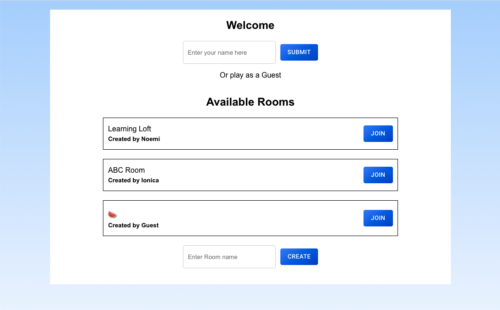

### Challenge - Homework 7
##### New Features:

- [x] Players can enter their names or play as guests.
  - The list of available rooms also includes the name of the person who created it (or *Guest* if they didn't enter a name)
  
  - After starting the game, the entered names(or *Guest*) are displayed instead of the words *You* and *Opponent*, respectively in the chat, the name of the person who sent the message appears
- [x] Each player has 60 seconds to act, otherwise he/she will lose the game. 
  
  

##### To run the Project:

`cd server`
`npm install`
`npm run devStart`

`cd client`
`npm install`
`npm start`